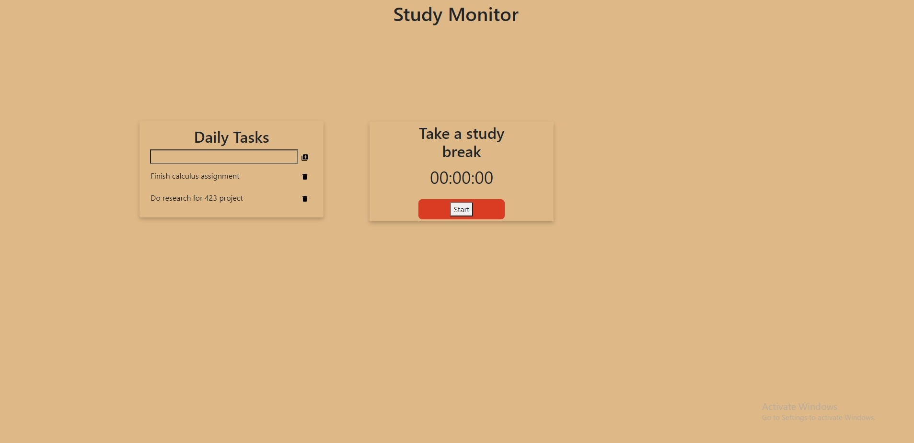

# Student Productivity Tool Web App
This is a full-stack app I made with React, Express, Node.js, and PostgreSQL. Users can add and delete daily tasks to the interface. They can use the timer, built using React hooks, to take study breaks or time their study sessions. In the future, I'm looking to improve the UI design and add more features.

